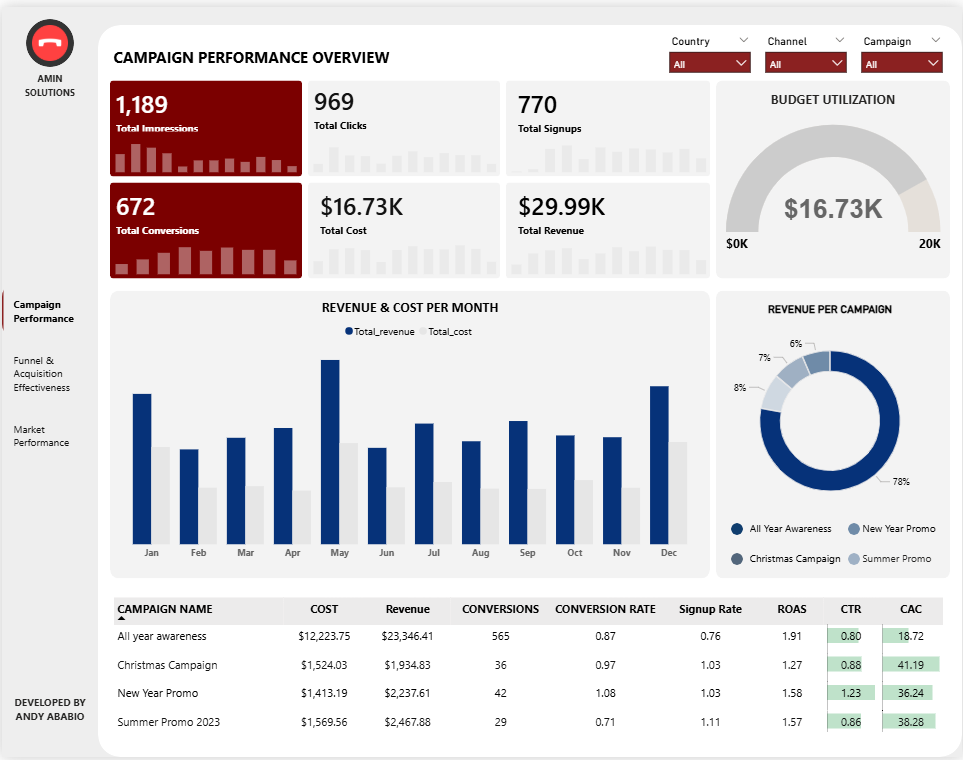
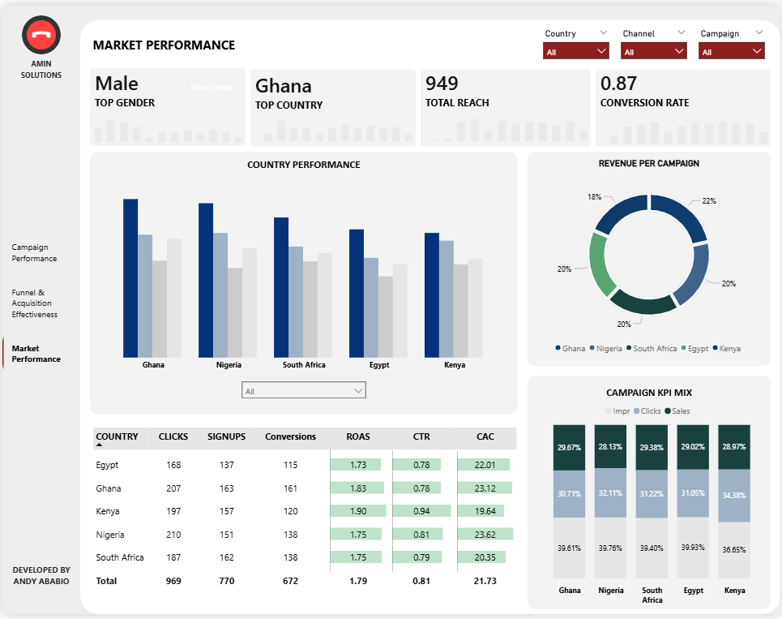
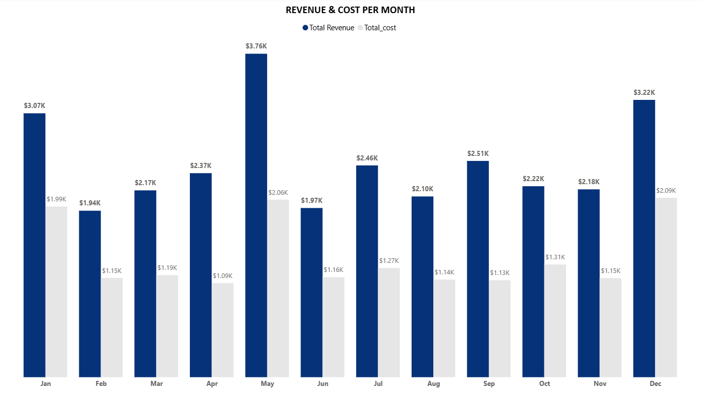
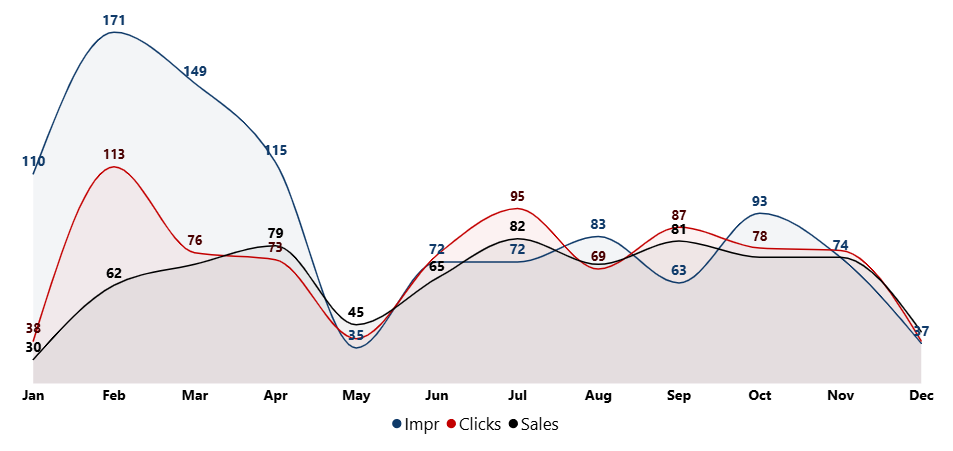
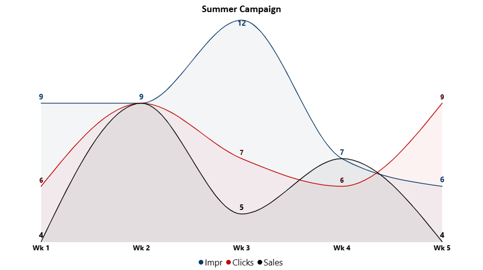
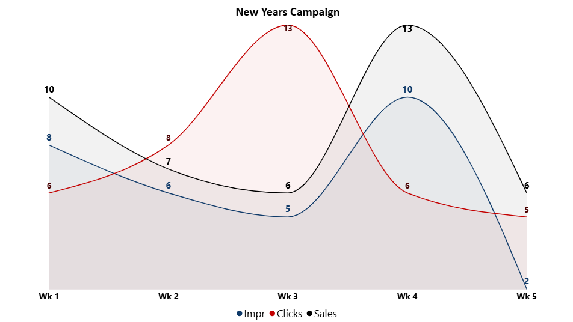
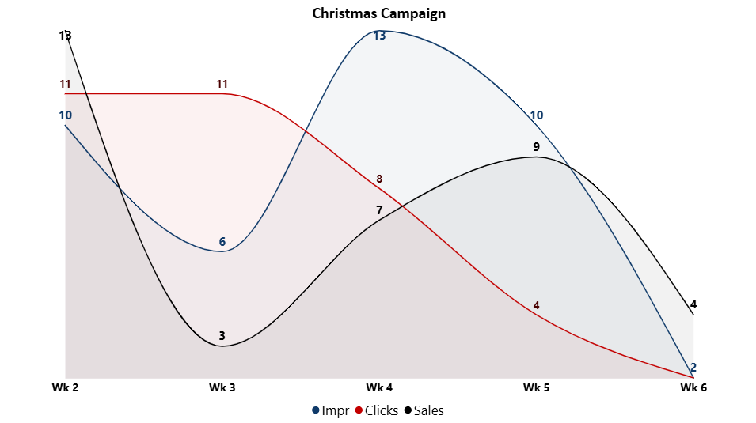
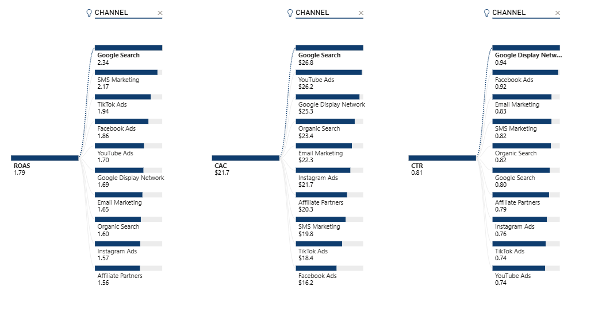

  

<h1 align="center">Marketing Analytics</h1>

IPSL-PAY is a fast-growing digital financial services company operating across multiple African markets. The company offers mobile-first financial products including instant micro-loans, savings wallets, bill payments, and merchant payment solutions targeted at underbanked and emerging middle-income users.

To drive user growth and revenue, IPSL runs multi-channel marketing campaigns across paid digital media (social, search, display). Campaigns range from always-on brand awareness initiatives to short-term seasonal promotions aimed at driving sign-ups and purchases of specific financial products.

As the marketing function scaled, the Head of Marketing identified the need for a centralized analytics model to track campaign performance, user acquisition, funnel progression, and revenue impact across markets and channels for 2024 marketing efforts. The business needed clear visibility into how users move from first exposure (impressions) through engagement (clicks), acquisition (sign-ups), and monetization (purchases), while also understanding marketing spend efficiency and return on investment. The key insights and recommendations focus on the following areas:

- Campaign Performance Trends:  
For each campaign, tracking marketing spend, impressions, clicks, sign-ups, purchases, and revenue over time.

- Funnel Performance & Channel Effectiveness:  
Analyzing user progression from awareness to conversion to identify drop-offs, acquisition efficiency, and conversion strength at each stage as well as determine most effective channels for each campaign type.

- Market Analysis:  
Assessing campaign reach and revenue performance across countries and markets to understand demand patterns and optimize market-level strategy.

<h1 align="center">Dashboard Overview</h1>

<h3 align="center">Campaign Performance</h3>

   

<h4 align="center">Funnel, Channel and Market Performance</h4>

      
      

  

<h2 align="center">Campaign Performance</h2>

| Overview |
|---------|
| Across all campaigns, marketing efforts generated 1,189 impressions, 969 clicks, 770 sign-ups, and 672 conversions, showing strong progression through the funnel with limited drop-off. Total marketing spend was $16.73K, generating $29.99K in revenue; an absolute uplift of $13.26K, representing an approximate 79% increase over cost, indicating strong overall campaign efficiency and profitability. |

   

  <!-- --------------------------------------------------------------------------------------------------------------------------------------------------------------------- -->

1. Monthly Revenue vs. Cost Analysis Across All Campaigns for 2024
   - Across all campaigns, revenue consistently outperformed cost every month, indicating sustained marketing profitability throughout the year. Peak performance occurred in May, where the highest revenue ($3.76K) was achieved alongside proportionally higher spend, suggesting effective scaling. 
   - While revenue consistently exceeded costs throughout the year, the efficiency of spend varied by month. December recorded the lowest ROAS at 1.55, indicating the least return per dollar spent, whereas August achieved the highest ROAS of 1.85, reflecting the most efficient campaign performance during the year. This highlights the need to investigate factors driving lower efficiency in certain months, despite overall profitability. 

2. Campaign Profitability Analysis: Revenue vs. Cost
   - Data showed the All Year Awareness campaign emerged as the most profitable, generating $23.35K in revenue from a $12.22K spend, with a ROAS of 1.91. In contrast, the Christmas Campaign had the lowest ROAS at 1.27, suggesting that while profitable, its efficiency per dollar spent was comparatively lower.
   - Its important to note that even amongst the short duration campaigns (which span for a month), the Christmas campaign returned the least, with Summer and New Year both exceeding a ROAS of 1.5.

<h2 align="center">Funnel & Acquisition Effectiveness</h2>

| Overview |
|---------|
| Overall funnel performance indicates efficient acquisition and strong revenue recovery. A CAC of $21.70 suggests that customer acquisition is being achieved at a controlled cost, while a ROAS of 1.79 confirms that marketing spend is generating positive returns, with revenue comfortably exceeding costs. Engagement and conversion signals remain healthy, with 883 completed sales reflecting effective movement through the funnel. While the CTR of 0.81% points to moderate ad engagement, the strong downstream performance suggests that users who do engage are high-quality and more likely to convert, indicating good audience targeting and funnel efficiency. |

<h3 align="center">All Year Campaign</h3>

   

<h4 align="center">Summer | New Year | Christmas</h4>

      
      
        

 

1. All Year Campaign
   - The all-year campaign delivers consistent sales throughout the year, even as impressions and clicks fluctuate
       - Feb–Apr show stronger engagement, driving higher sales.
       - May stands out with low reach but strong sales, indicating high conversion efficiency.
       - Jul–Sep maintain stable performance, reflecting a healthy funnel.
       - Jan and Dec record the lowest activity, likely due to seasonal effects.
       - Overall, the campaign shows strong conversion quality and resilience across months.

3. Summer Campaign
   - The summer campaign shows compact but effective performance within a short run period.
       - Week 2 is the strongest, matching clicks with sales, indicating excellent conversion.
       - Weeks 4 and 5 maintain solid sales despite lower impressions, suggesting efficient targeting.
       - Week 3 records the highest impressions but weaker sales, pointing to softer conversion quality.
       - Overall, the campaign demonstrates strong week-to-week efficiency, with performance driven more by conversion effectiveness than reach.

4. New Year Campaign
   - The campaign shows strong conversion efficiency despite low impressions.
       - Week 1 and Week 4 stand out, where sales exceed or closely match clicks, indicating high purchase intent.
       - Week 3 records the highest click volume but weaker sales conversion, suggesting drop-off post-engagement.
       - Week 5 maintains solid sales with minimal impressions, highlighting late-campaign efficiency.
       - Overall, the New Year campaign performs best in conversion quality rather than volume, making it effective even with limited reach.

5. Christmas Campaign
   - Performance is varies across the campaign period.
       - Week 2 delivers the strongest results, with high sales relative to clicks and impressions.
       - Week 3 shows weaker efficiency, where clicks did not translate well into sales.
       - Weeks 5–6 achieve reasonable sales despite low traffic, indicating late-stage purchase intent.
       - Overall, the campaign benefits from strong early momentum, followed by more selective but conversion-driven activity toward the end.

<h3 align="center">Funnel Effectiveness</h3>

   

 - Google Search delivers the strongest return, with the highest ROAS (2.34), though it comes at the highest CAC ($26.80), indicating high-intent but costly acquisition.
- SMS Marketing and TikTok Ads strike the best balance, combining strong ROAS (2.17 and 1.94) with lower CACs ($19.80 and $18.40).
- Facebook Ads perform efficiently, showing a high CTR (0.92) alongside a solid ROAS (1.86), suggesting strong engagement and conversion potential.
- Google Display Network achieves the highest CTR (0.94) but a relatively high CAC, implying strong visibility with weaker cost efficiency.
- Affiliate Partners and Instagram Ads underperform comparatively, with lower ROAS and CTR, indicating opportunities for optimization or budget reallocation.

<h1 align="center">Process Flow and Code (technical) </h1>
