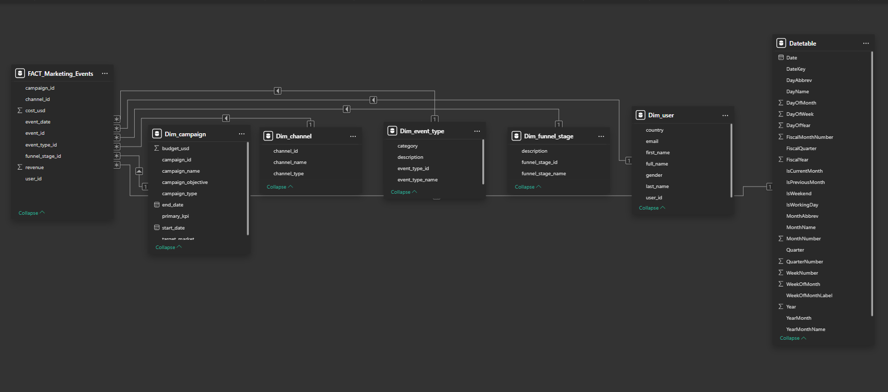

## 🔄 Process Flow

◼ Data Preparation (Excel):
 - The raw retail data was cleaned and transformed in Microsoft Excel.  

◼ Data Modeling (Power BI):
 - The cleaned datasets were imported into Power BI for data modeling.

◼ Data Visualization & Analysis:
 - I then developed interactive visuals and KPIs in Power BI using **DAX** to highlight trends, relationships, and performance metrics.

---

## 🗂️ Dataset Overview

🟥 Fact Table:
 - fact_marketing_events: event_id, delete, event_date, campaign_id (FK), user_id (FK), channel_id (FK), funnel_stage_id (FK), event_type_id (FK), cost_usd, revenue

🟥 Dimension Tables:
 - dim_campaign: campaign_id, campaign_name, campaign_objective, start_date, end_date, budget_usd, target_market, campaign_type, primary_kpi
 - dim_user: user_id, first_name, last_name, full_name, email, gender, country
 - dim_channel: channel_id, channel_name, channel_type
 - dim_funnel_stage: funnel_stage_id, funnel_stage_name, description
 - dim_event_type: event_type_id, event_type_name, category, description

Relevant relationships were then established between the above table to produce the following data model:
 

 
 

